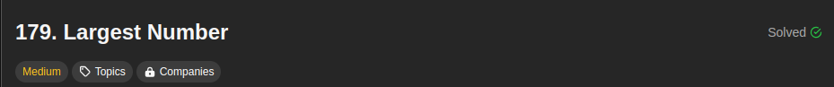
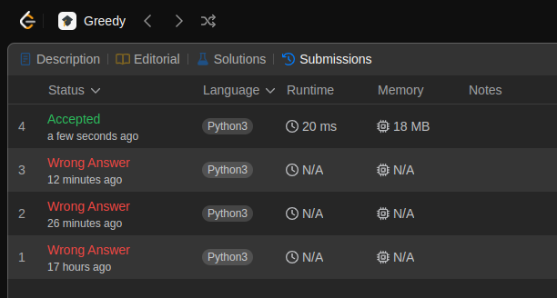
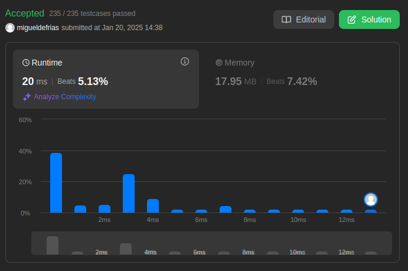

## 179. Largest Number

[Link para a questão](https://leetcode.com/problems/largest-number/description/)

### Gravação

[Link para a gravação]()

#### Dificuldade: Média

### Enunciado

Given a list of non-negative integers nums, arrange them such that they form the largest number and return it.

Since the result may be very large, so you need to return a string instead of an integer.

 

**Example 1:**

Input: nums = [10,2]
Output: "210"
Example 2:

Input: nums = [3,30,34,5,9]
Output: "9534330"
 

**Constraints:**

1 <= nums.length <= 100
0 <= nums[i] <= 109

### Submissões: 

